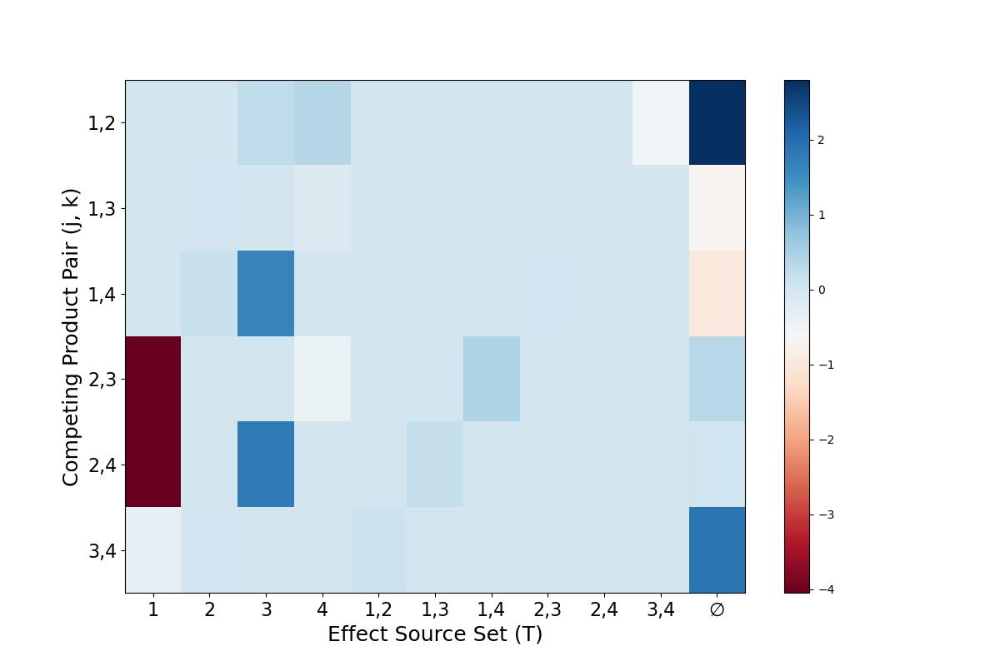

# DeepHalo Tensorflow Implementation

This repository contains a tensorflow implementation for DeepHalo model with full code to perform data generation and synthetic experiments as presentated in the paper. 
---

## 1. Requirement
```bash
numpy
pandas
matplotlib
tensorflow 2.16.1
```


## 2. Usage

Gerenate synthetic data:

```bash
python data/hypothetical.py
python data/synthetic.py
```

Perform experiments (and the outputs will be saved into ```result```):

```bash
python exp_hypothetic.py
python exp_synthetic.py
```

## 3. Replicated results

<figure>
  
</figure>

<figure>
  
</figure>


