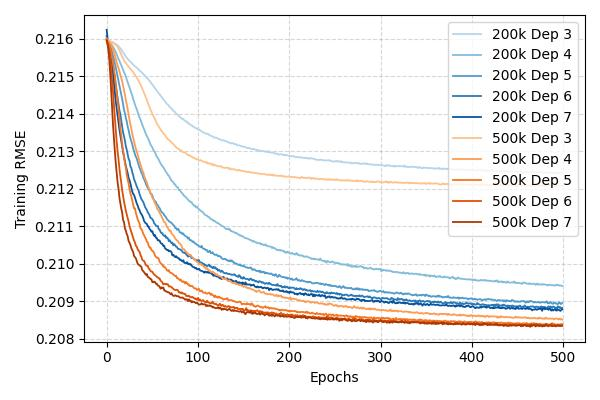

# DeepHalo Tensorflow Implementation

This repository contains a tensorflow implementation for DeepHalo model with full code to perform data generation and synthetic experiments as presentated in the paper. 
---

## 1. Requirement
```bash
numpy
pandas
matplotlib
tensorflow 2.16.1
pytest
```

## 2. Test
Under the ```./model``` root:
```bash
pytest -q 
```
You should get something like
```bash
==================== test session starts ====================

tests/test_featureless.py .....
tests/test_featurebased_utils.py ..
tests/test_featurebased_network.py ..

===================== 7 passed in 1.23s =====================
```

## 3. Usage

Gerenate synthetic data:

```bash
python data/hypothetical.py
python data/synthetic.py
```

Perform experiments (and the outputs will be saved into ```result```):

```bash
python exp_hypothetic.py
python exp_synthetic.py
```

## 4. Replicated results

<figure>
  
</figure>

<figure>
  
</figure>


