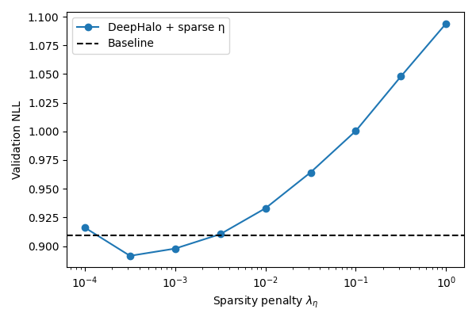

# Lu25 Tensorflow Implementation

This repository contains a tensorflow implementation for BLP and MCMC simulations in Lu25, as well as the simulation to combine deephalo and sparse shock info as proposed in lu25.
---

## 1. Requirement
```bash
numpy
pandas
matplotlib
tensorflow 2.16.1
temsroflow_probability 
pytest
```

## 2. Test
Under the ```./q2``` root:
```bash
pytest -q 
```
You should get something like
```bash
=============================================================== test session starts ================================================================
platform darwin -- Python 3.10.19, pytest-9.0.2, pluggy-1.6.0
collected 11 items                                                                                                                                 
tests/test_blp.py ..                                                                                                                         [ 18%]
tests/test_dgp.py ...                                                                                                                        [ 45%]
tests/test_invariants.py ...                                                                                                                 [ 72%]
tests/test_shrinkage.py ...                                                                                                                  [100%]

================================================================ 11 passed in 4.29s ================================================================
```

## 3. Usage

Reproduce tables 1-4 in lu25 (and the outputs will be saved automatically):

```bash
python lu25.py
```

Perform simulation combining deephalo and sparse shock as proposed in lu25:

```bash
python deephalo_lu25.py
```

and the resulted figure is

<figure>
  
</figure>


